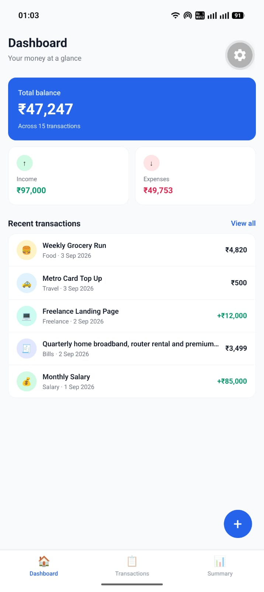
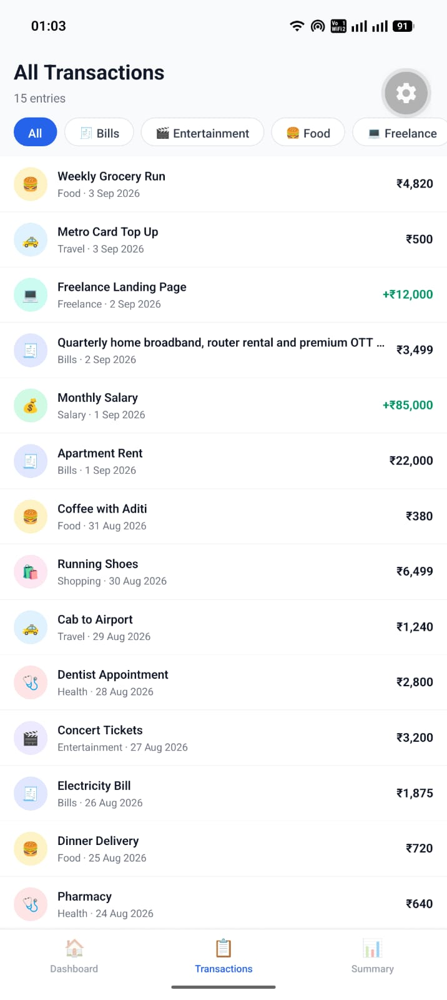
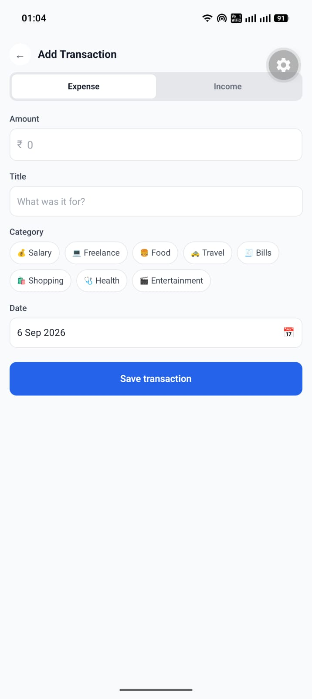
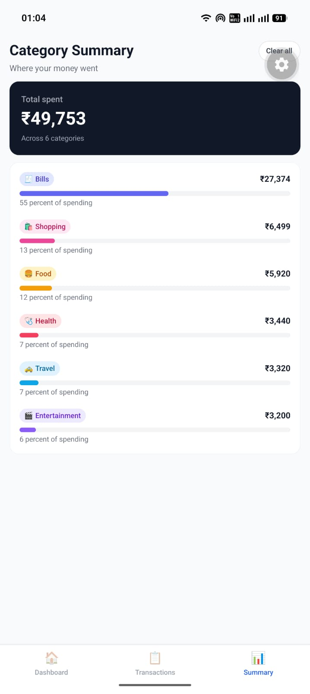
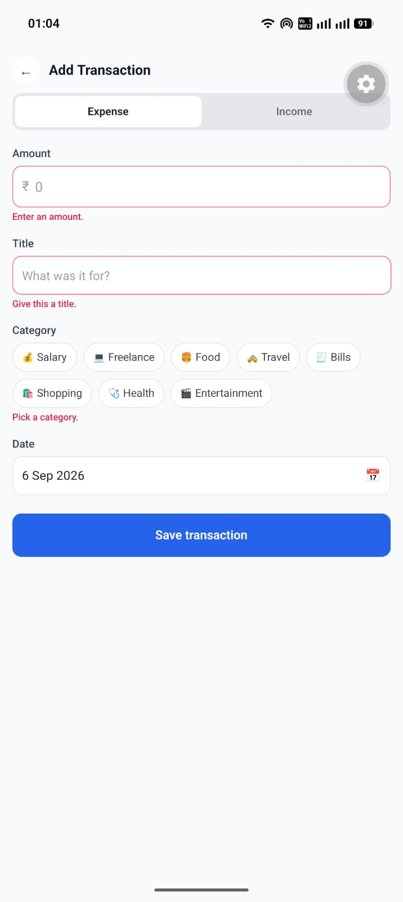
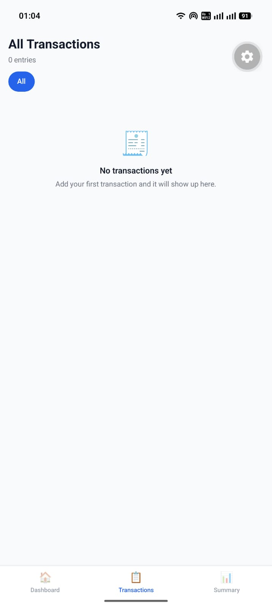

# Expense Tracker

A mobile expense tracker built with React Native and Expo, styled entirely with NativeWind. It shows a running balance, a filterable list of income and expenses, a form for adding new entries, and a breakdown of spending by category.

This is a UI only app. There is no backend and no network calls of any kind. All data comes from static JSON files in the `data` folder and lives in memory while the app runs.

## Screens

**Dashboard.** Total balance, income and expenses at a glance, the five most recent transactions, and a floating button for adding a new one.

**All Transactions.** The full list of income and expenses, with a row of category buttons that filter it instantly. Each row shows the category icon, title, category, date and amount.

**Add Transaction.** A form for a new entry with income and expense types, an amount field, a title, a category picker and a calendar for the date. Fields are checked when you save and any problem is shown under the field it belongs to.

**Category Summary.** Spending grouped by category, sorted highest first, with a bar showing each category's share of total spending.

**Empty and error states.** Every list has a designed empty state rather than a blank area, and there is an error screen for when the data cannot be read. The Clear all button on the Category Summary screen empties the list so the empty states can be seen.

## Screenshots

| Dashboard | All Transactions | Add Transaction |
|---|---|---|
|  |  |  |

| Category Summary | Inline validation | Empty state |
|---|---|---|
|  |  |  |

## Running it

You need Node installed, and the Expo Go app on an Android or iOS phone.

```bash
npm install
npx expo start
```

Then open Expo Go on your phone and scan the QR code shown in the terminal. The phone and the computer need to be on the same network.

If the phone cannot reach the computer, `npx expo start --tunnel` routes through a public URL instead and works across different networks.

## How it is built

```
data/                 mock data, kept out of the app code
  transactions.json   fifteen sample transactions
  categories.json     category names, icons and colours
  index.js            exports both, plus a safe category lookup

src/
  components/         reusable pieces shared across screens
  context/            the in memory store every screen reads from
  navigation/         the tab and stack navigators
  screens/            one file per screen
  utils/              money and date formatting
```

Every screen reads from a single React context, so adding a transaction on the form updates the dashboard totals, the full list and the category bars at once.

Styling is NativeWind throughout. There is no `StyleSheet.create` and no inline style objects anywhere in the project.

The only interface library used is React Navigation, for the bottom tabs and the stack. The progress bars, the category picker and the date calendar are all built from plain views, as are the empty, error and loading states.

## Notes

The progress bar widths come from utility classes rather than inline styles. Percentage widths are added to the Tailwind theme and safelisted in `tailwind.config.js`, so a class name built while the app is running still resolves to a compiled style.

Money is grouped in the Indian style by hand rather than through the built in locale formatting, which is not always complete on device. Dates are read straight from their text form so that a timezone can never shift the day.
